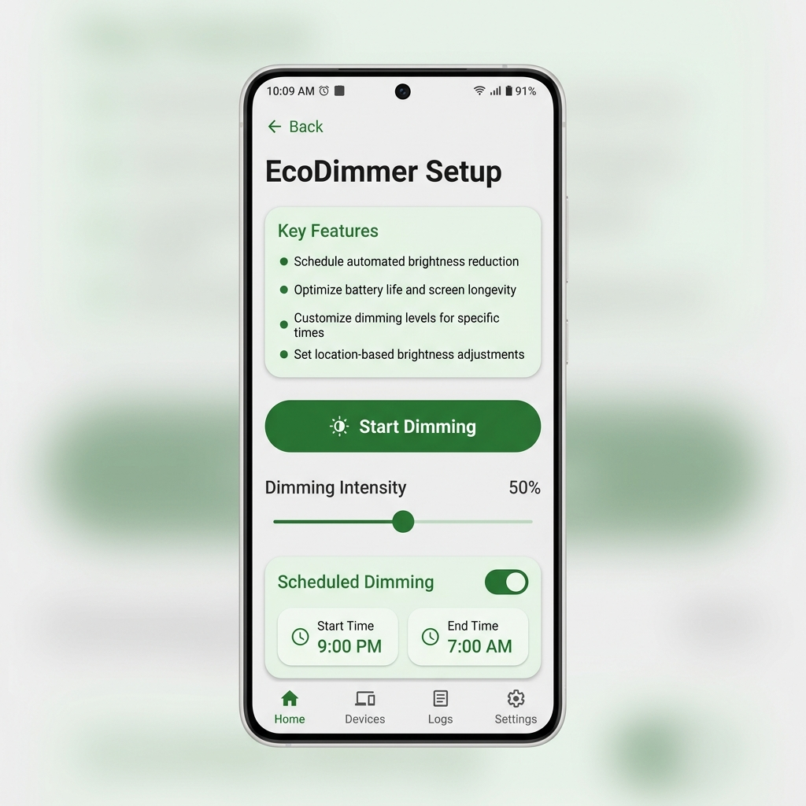
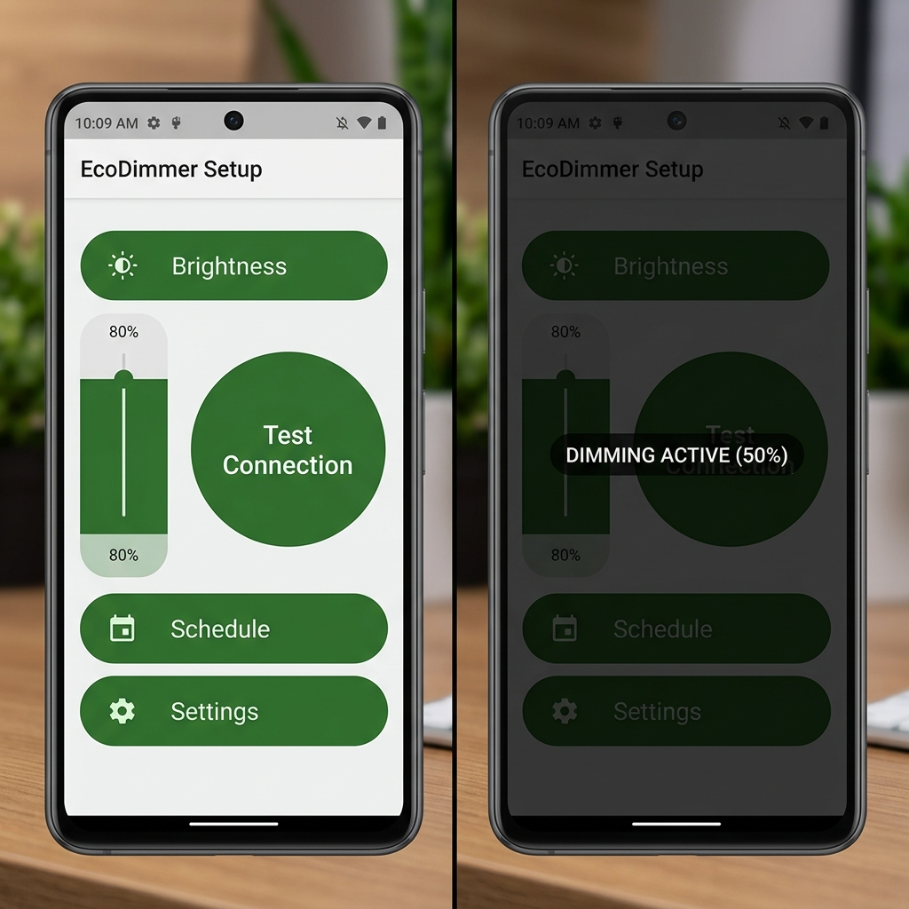
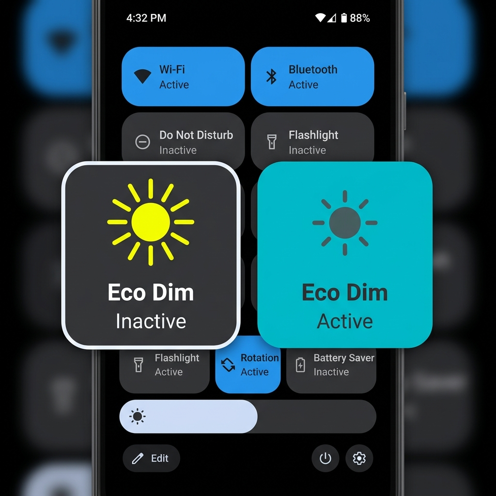

# EcoDimmer

EcoDimmer is a powerful, privacy-focused Android utility that allows you to dim your screen beyond the system minimum. 

## 📸 Screenshots

| Setup UI | Full-Screen Dimming | Dynamic QS Tiles |
| :---: | :---: | :---: |
|  |  |  |

## 📋 Requirements
- **Minimum Android Version**: Android 8.0 (Oreo) / API 26 or higher.
- **Overlay Permission**: Requires the `Draw over other apps` permission (`SYSTEM_ALERT_WINDOW`).
- **UPI Auto‑Disable**: The dimmer automatically disables when a known UPI app is in the foreground.

### 🚀 Key Features:
- **Full-Screen Dimming**: Unlike most apps, EcoDimmer dims the status bar, notification shade, and navigation bar.
- **Adjustable Intensity**: Precision slider to set the exact darkness you need.
- **Shake to Rescue**: Vigorous shake gesture to emergency-disable the dimmer (useful if the screen is too dark to see).
- **Scheduled Dimming**: Set automatic ON/OFF times.
# Updated content
21: - **Privacy First**: Requires **zero standard permissions**. Uses a foreground Service with overlay permission for dimming.
22: - **Eco-Friendly**: Saves battery on AMOLED screens and reduces eye strain.
23: - **Invisible Launcher**: Hides from the app drawer for a clean look. Access settings via a **long-press** on the Quick Settings tile.
24: 
### 🤖 Created by Antigravity
This application was entirely designed, architected, and developed by **Antigravity**, an agentic AI coding assistant by Google DeepMind. It serves as a demonstration of high-quality, production-ready mobile development achieved through AI collaboration.

## 🛠 Built With
- **Kotlin**: The modern, type-safe programming language for Android.
- **Jetpack Compose**: Android’s modern toolkit for building native UI.
- **Material 3**: The latest design system from Google for beautiful, accessible apps.
- **GitHub Actions**: Automated CI/CD pipeline for APK generation and releases.

## 🏗 Project Architecture
EcoDimmer is built with a focus on privacy and performance:
- **Accessibility Service**: Used to draw a system-wide overlay that covers the status bar and notifications.
- **Custom Overlays**: Leverages `WindowManager` with `TYPE_ACCESSIBILITY_OVERLAY` for consistent dimming.
- **Sensor Logic**: Integrated accelerometer listeners for the "Shake to Rescue" safety feature.
- **Privacy Hardened**: Explicitly disables screen-reading (`canRetrieveWindowContent="false"`) and has no internet permissions.

## 🔨 Development & Building
To build the project from source:
1. Clone the repository.
2. Open in **Android Studio (Koala or newer)**.
3. Ensure you have the **Android SDK 34** installed.
4. Build the project using the Gradle wrapper:
   ```bash
   ./gradlew assembleDebug
   ```

### 🛠 Installation
1. Download the latest `eco-dimmer.apk` from the [Releases](https://github.com/cartman-156/EcoDimmer/releases) section.
2. Install the APK (you may need to allow "Install from Unknown Sources").
3. Edit your Quick Settings panel and drag the **Eco Dim** tile into your active list.
4. **Long-press** the tile to open the setup screen and grant the Accessibility permission.

### ⚖ License
This project is licensed under the MIT License - see the [LICENSE](LICENSE) file for details.
